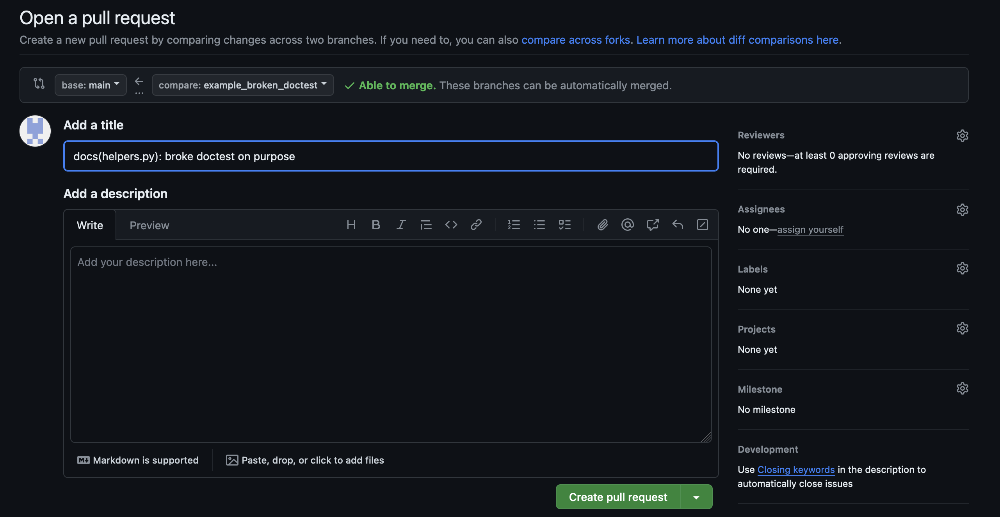
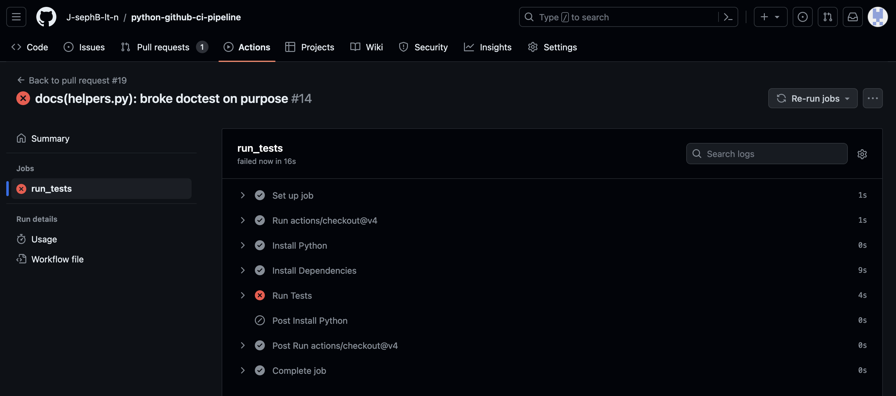
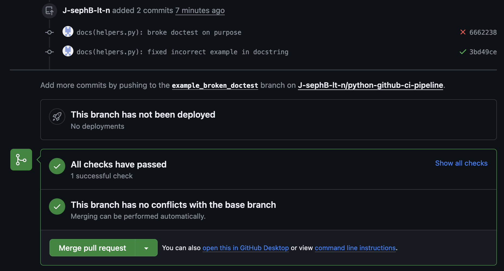

# Tutorial: How to Build a Continuous Integration Pipeline using GitHub Actions

!!This tutorial is still under heavy construction!!

A working version of the CI pipeline described in this tutorial is available in the public github repository https://github.com/J-sephB-lt-n/python-github-ci-pipeline (you can fork this repo and try it out for yourself). Everything will work even if you are using a free GitHub account, as long as your fork is a public repository. 

## Contents 

* [What is CI/CD and Why Would We Want It?](#what-is-cicd-and-why-would-we-want-it)

* [Prerequisite Knowledge](#prerequisite-knowledge)

* [What You Will Learn in this Tutorial](#what-you-will-learn-in-this-tutorial)

* [A Quick Intro to the Core Tools](#a-quick-intro-to-the-core-tools)

* [CI Pipeline in GitHub](#ci-pipeline-in-github)

    - [How it Looks](#ci-pipeline-in-github-how-it-looks)

    - [How to Build It](#ci-pipeline-in-github-how-to-build-it)

* [Next Steps](#next-steps)

## What is CI/CD and Why Would We Want It?

[CI/CD](https://en.wikipedia.org/wiki/CI/CD) stands for [Continuous Integration / Continuous Delivery](https://en.wikipedia.org/wiki/CI/CD). It is a [Dev-Ops](https://en.wikipedia.org/wiki/DevOps) software development style which is designed to make the process of releasing software updates as fast and as seamless as possible. 

It consists of two distinct parts:

| Software Development Practice | Basic Idea
|-------------------------------|--------------------------------------------------------------------------------------------------------------------------------
| <a id=ci>Continuous Integration</a> (CI)   | Developers working on the same project merge their new code into the central shared code base very frequently (typically at least once per day) <br>i.e. code contributions by team members are integrated into the production code base continuously.
| <a id=cd>Continuous Delivery</a> (CD)      | Production software builds are released very frequently <br> i.e. user-facing software updates are released almost continuously.

In order to release stable and trustworthy software, a lot of quality and stress testing is required, and both continuous [integation](#c1) and [delivery](#cd) achieve this by automating all of these tests.

This tutorial demonstrates how an automated [Continuous Integration](https://en.wikipedia.org/wiki/Continuous_integration) process can be set up in [GitHub](https://github.com) using [GitHub Actions](https://docs.github.com/en/actions). Again, you can see the working code [here](https://github.com/J-sephB-lt-n/python-github-ci-pipeline).

## Prerequisite Knowledge

This tutorial assumes that you have a rudimentary understanding of the version control system [git](https://git-scm.com), specifically these concepts:

* local and remote repositories 

* branches 

* git merge

* git pull

* git push

* pull request

If you've never heard any of these terms before, I would recommend reading an introductory article on [git](https://git-scm.com) ([this one](https://dev.to/ionos/an-introduction-to-git-the-basics-every-beginning-developer-should-know-o62) is not bad).  

Primarily, [git](https://git-scm.com) keeps a history of all changes made to a shared codebase, and also helps to manage conflicts when multiple people make edits to the same piece of code at the same time. 

## What You Will Learn in this Tutorial
In this tutorial, we're building a CI pipeline using [GitHub Actions](https://docs.github.com/en/actions). The reasons that I chose to use the enterprise platform [GitHub](https://github.com/) for this are:

1. [GitHub](https://github.com/) has a generous free tier (i.e. you can do a lot without having to pay anything)

2. All of the biggest python libraries host their source code on [GitHub](https://github.com/). Examples are [Requests](https://github.com/psf/requests), [Flask](https://github.com/pallets/flask/), [FastAPI](https://github.com/tiangolo/fastapi), [mypy](https://github.com/python/mypy), [Numpy](https://github.com/numpy/numpy), [Pandas](https://github.com/pandas-dev/pandas), [PyTorch](https://github.com/pytorch/pytorch), [TensorFlow](https://github.com/tensorflow/tensorflow), [SciKit-Learn](https://github.com/scikit-learn/scikit-learn), [matplotlib](https://github.com/matplotlib/matplotlib), [SQLAlchemy](https://github.com/sqlalchemy/sqlalchemy) etc. etc. etc. (even [python itself](https://github.com/python/cpython)).

This flowchart illustrates the core behaviour of the CI pipeline which we're going to build (I'm ignoring the added complexity of local vs. remote git repos for now):

```mermaid
---
title: Continuous Integration Pipeline 
---
flowchart TD;
    A["Production codebase <br>(git main branch)"] -. "developer writes some new <br>new code on a feature branch<br>(git checkout feature_branch)" .-> C["Local copy of production codebase<br>with new code<br>(git feature branch)"]
    C -. "developer attempts to merge new<br>code into production codebase<br>(git push origin main)<br>(github pull request)" .-> D{"System checks for<br>merge conflicts and<br>runs all tests<br>(github actions)"}
    D -- "all tests pass" --> E{System accepts <br>merge}
    E -. "code merged into<br>production codebase " .-> A
    D -- "1 or more tests fail" --> F{System rejects <br>merge}
    F -. "developer adapts their code<br>to make the tests pass" .-> C
```

## A Quick Intro to the Core Tools

Although not the focus of this tutorial, here is a short description of all of the tools you'll be exposed to in this tutorial: 

| Tool                         | Description
|------------------------------|-------------------
| [Git](https://git-scm.com/)  | The most widely used version control system for managing codebases. [Git](https://git-scm.com/) keeps a full history of every change made to the code, and makes it easy to explore this history. [Git](https://git-scm.com/) is also very good at merging the work of multiple authors on the same file (and elegantly resolving their conflicts).    
| [GitHub](https://github.com/)|
| [GitHub Actions and Branch Protection Rules](#github-actions-and-branch-protection-rules) | 
| [PyTest](#pytest) | 
| [MkDocs and MkDocStrings (Documentation)](#mkdocs-and-mkdocstrings-documentation) | 
| [Ruff (Code Formatter)](#ruff-code-formatter) | 
| [MyPy (Type Checking)](#mypy-type-checking) | 
| [PyLint (Code Analyser)](#pylint-code-analyser) | 

## CI Pipeline in GitHub

### CI Pipeline in GitHub: How it Looks

```bash
~$ git checkout -b "example_broken_doctest"
Switched to a new branch 'example_broken_doctest'
```
```bash
~$ git status
On branch example_broken_doctest
Changes not staged for commit:
  (use "git add <file>..." to update what will be committed)
  (use "git restore <file>..." to discard changes in working directory)
	modified:   diffie_hellman_merkle/helpers.py
~$ git add .
~$ git status
On branch example_broken_doctest
Changes to be committed:
  (use "git restore --staged <file>..." to unstage)
	modified:   diffie_hellman_merkle/helpers.py
```
```bash
~$ git commit -m "docs(helpers.py): broke doctest on purpose"
[example_broken_doctest 6662238] docs(helpers.py): broke doctest on purpose
 1 file changed, 1 insertion(+), 1 deletion(-)
```
```bash
~$ git push
fatal: The current branch example_broken_doctest has no upstream branch.
To push the current branch and set the remote as upstream, use

    git push --set-upstream origin example_broken_doctest

To have this happen automatically for branches without a tracking
upstream, see 'push.autoSetupRemote' in 'git help config'.
```
```bash
~$ git push --set-upstream origin example_broken_doctest
Enumerating objects: 7, done.
Counting objects: 100% (7/7), done.
Delta compression using up to 8 threads
Compressing objects: 100% (4/4), done.
Writing objects: 100% (4/4), 438 bytes | 438.00 KiB/s, done.
Total 4 (delta 2), reused 0 (delta 0), pack-reused 0
remote: Resolving deltas: 100% (2/2), completed with 2 local objects.
remote: 
remote: Create a pull request for 'example_broken_doctest' on GitHub by visiting:
remote:      https://github.com/J-sephB-lt-n/python-github-ci-pipeline/pull/new/example_broken_doctest
remote: 
To https://github.com/J-sephB-lt-n/python-github-ci-pipeline.git
 * [new branch]      example_broken_doctest -> example_broken_doctest
branch 'example_broken_doctest' set up to track 'origin/example_broken_doctest'.
```










### CI Pipeline in GitHub: How to Build It

## Next Steps
